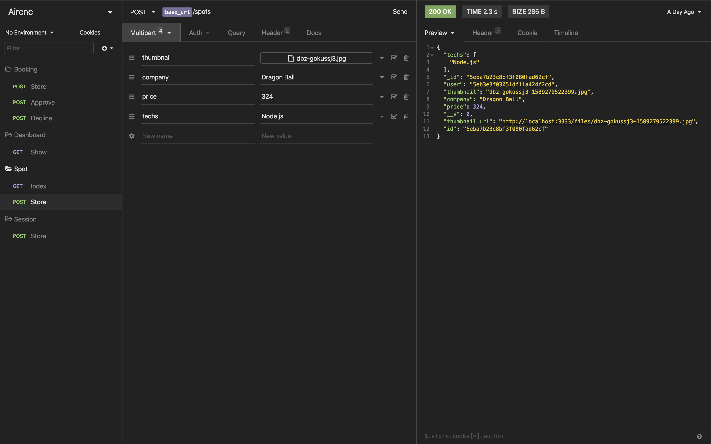
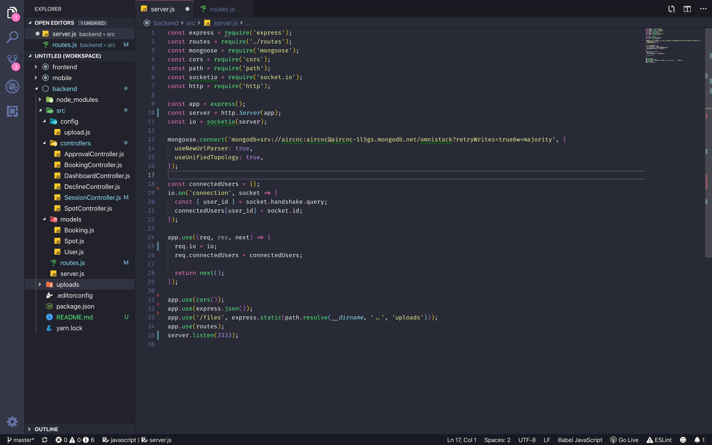
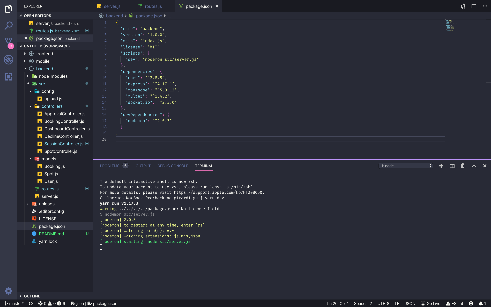

# Aircnc - Backend

This is the backend of the **Aircnc** project developed by [**_Rocketseat_**](https://rocketseat.com.br/), a Brazilian company that teaches Node.JS, ReactJS and React Native.
This is a project where I could learn many professional techniques that is used in "the real world".

## About the project

- The **Aircnc** is an application where a company can share a spot inside of your building to other developers to use it daily.
- The **_company_** access the website to register a spot saying the company's name, which technology they use and the price.
- The **_user_** access the app to search for a spot. He/She enter with an email and which technologies they work with and then they are send to another page where they can find some spots and request a date.
- The **_company_** receives this request in real-time and can accept or decline it sending the answer also in real-time to the **_user_**.

## The backend

The backend was developed with [**_Node.js_**](https://nodejs.org/en/) and [**_Express.js_**](https://expressjs.com/) ( _framework_ ) using MVC as a design pattern. The application is based on a server which is the [**_MongoDB Atlas_**](https://www.mongodb.com/cloud/atlas).
The REST API was tested using [**_Insomnia_**](https://insomnia.rest/) and I also used [**_Mongoose_**](https://mongoosejs.com/), a library that facilitates the work with **_MongoDB_**.

**INSOMNIA**

**server.js**

## Getting started

1.  Prerequisites

- npm

      npm install npm@latest -g

2. Installation

- Clone the repo

      git clone https://github.com/euguilhermegirardi/Aircnc-Backend.git

3. Install NPM packages

   npm install

4. Run the application

   npm run dev

**package.json/server-running**

## Contributing

1.  Fork the project
2.  Create your feature branch (`git checkout -b feature/AmazingFeature`)
3.  Commit your changes (`git commit -m 'Add some AmazingFeature'`)
4.  Push to the branch (`git push origin feature/AmazingFeature`)
5.  Open a pull request

## License

